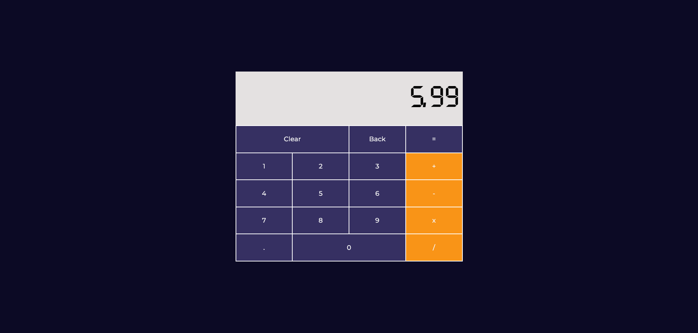

# Calculator

This is project given in [Odin Project Curriculum](https://www.theodinproject.com/lessons/foundations-calculator). Implemented using JavaScript.

### How It Works

It is basic Calculator that does basic math calculation using operators: +, -, x, /
First you Input first operand then the operator and then the second operand
The final result get stored in first operand in case you want to perform multiple operators.

So, 12 + 3 x 9 - 3  
    => 15 x 9 - 3  
    => 135 - 3  
    => 132

Live Preview: [website-link](https://akanksha493.github.io/Calculator/)

Screenshot:

### Useful Resources

Online resources used:

1. for restart bttn: [clear bttn](https://teamtreehouse.com/community/any-one-know-how-to-make-a-restart-button)
2. [javascript-info-arrayMethods](https://javascript.info/array-methods), [javascript-info-objects](https://javascript.info/object)
4. [color pallet - colorhunt.co](https://colorhunt.co/palette/3630624d4c7df99417f5f5f5)
3. [digitalfont-fontspace.com](https://www.fontspace.com/category/watch), [how to add downloaded font](https://www.youtube.com/watch?v=4yiJyHAn9EI), [google font](https://fonts.google.com/specimen/Montserrat)

